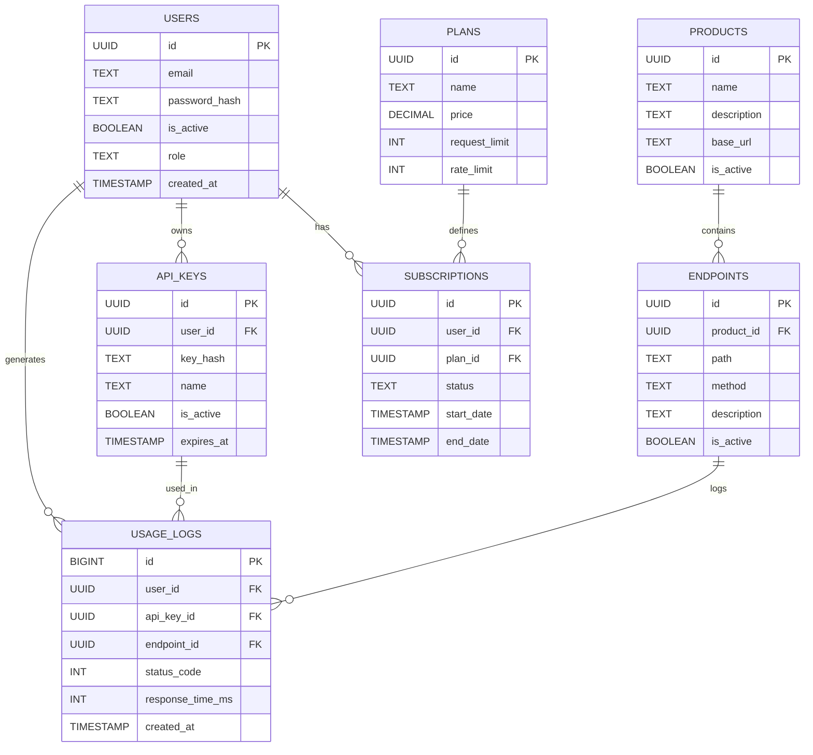
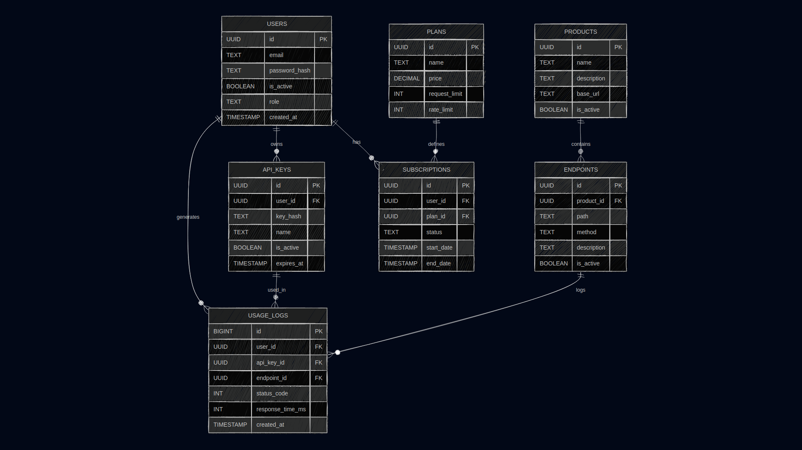

# Mermaid Diagram
The models for the Marketplace are tried to be replicated like this.

```mermaid
erDiagram

    USERS {
        UUID id PK
        TEXT email
        TEXT password_hash
        BOOLEAN is_active
        TEXT role
        TIMESTAMP created_at
    }

    API_KEYS {
        UUID id PK
        UUID user_id FK
        TEXT key_hash
        TEXT name
        BOOLEAN is_active
        TIMESTAMP expires_at
    }

    PRODUCTS {
        UUID id PK
        TEXT name
        TEXT description
        TEXT base_url
        BOOLEAN is_active
    }

    ENDPOINTS {
        UUID id PK
        UUID product_id FK
        TEXT path
        TEXT method
        TEXT description
        BOOLEAN is_active
    }

    PLANS {
        UUID id PK
        TEXT name
        DECIMAL price
        INT request_limit
        INT rate_limit
    }

    SUBSCRIPTIONS {
        UUID id PK
        UUID user_id FK
        UUID plan_id FK
        TEXT status
        TIMESTAMP start_date
        TIMESTAMP end_date
    }

    USAGE_LOGS {
        BIGINT id PK
        UUID user_id FK
        UUID api_key_id FK
        UUID endpoint_id FK
        INT status_code
        INT response_time_ms
        TIMESTAMP created_at
    }

    %% RELATIONSHIPS

    USERS ||--o{ API_KEYS : owns
    USERS ||--o{ SUBSCRIPTIONS : has
    USERS ||--o{ USAGE_LOGS : generates

    API_KEYS ||--o{ USAGE_LOGS : used_in

    PRODUCTS ||--o{ ENDPOINTS : contains

    ENDPOINTS ||--o{ USAGE_LOGS : logs

    PLANS ||--o{ SUBSCRIPTIONS : defines
```

